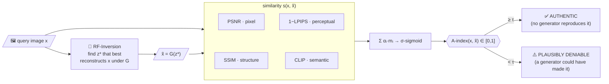
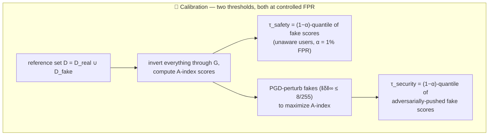
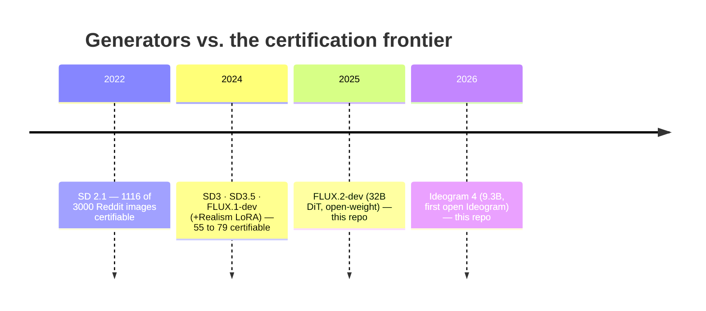

# 🕵️ The Liar's Dividend — Generation & Inversion Toolkit

> **Robust and Calibrated Detection of Authentic Multimedia Content** (USENIX Security '26 submission)
> Private research repo — generation + inversion code behind the paper's benchmark.

   

---

## 💡 The idea in 30 seconds

Deepfake **detection** is fundamentally unreliable: generators can reproduce authentic
data (memorization, distributional convergence), so the false-positive rate of any
real-vs-fake classifier is uncontrollable. We flip the problem into **content
authentication**: certify an image as *authentic* only if **no known generator can
faithfully reproduce it**. If a generator *can* reproduce it, its authenticity is
**plausibly deniable** — that's the liar's dividend.



Unlike deepfake detection, this direction **calibrates**: reconstruction fidelity of
generated content is bounded and measurable, so thresholds control FPR.



**Headline results:** six zero-shot deepfake detectors collapse to ≈0% accuracy under
PGD (ε=8/255) while A-index distributions stay separated · a medium-resource attacker
(N=100 seeds + PGD) moves the score only 0.0148 → 0.0154, below both thresholds ·
on ~3,000 Reddit images, SD2.1 certifies 1,116 as authentic but 2024-era generators
shrink that to 55–79 — **post-hoc verifiability is eroding**.

---

## ⚔️ The arms race this repo extends

Each new generator generation reconstructs real content better, shrinking what can be
certified. This repo adds the **2025 and 2026 columns** to that timeline — and feeds
the era-matched *detector-vs-generator* benchmark (each year's detectors against that
year's generator, 100 real + 100 fake per matchup, fixed prompts, seed 42):



| Generator | Year | Images | Status |
|---|---|---|---|
| SD 2.1 | 2022 | ✅ 353 real / 355 fake | existing set |
| SD 3 medium | 2024 | ✅ 324 / 329 | existing set |
| SD 3.5 medium | 2024 | ✅ 1272 / 1279 | existing set |
| FLUX.1-dev (± Realism LoRA) | 2024 | ✅ 490 / 490×2 | existing set |
| **FLUX.2-dev** | **2025** | 🎯 100 / 100 | **`generation/gen_flux2.py`** |
| **Ideogram 4 (fp8)** | **2026** | 🎯 100 / 100 | **`generation/gen_ideogram4.py`** |

Calibrated safety thresholds from the paper (α = 1% FPR): SD2.1 **0.0150** · SD3 **0.0368** ·
SD3.5 **0.0365** · FLUX-dev **0.0350** · FLUX-dev+LoRA **0.0380** — thresholds *rise* with
generator capability.

---

## 🗂️ Repo layout

```
📦 liars-dividend-generation
 ┣ 📜 SKILL.md            ← 🤖 agent runbook: run the 2025/2026 generation end-to-end
 ┣ 📂 generation/
 ┃ ┣ prompts.csv          ← the fixed 100-prompt benchmark set (filename ↔ prompt)
 ┃ ┣ prompts.txt          ← same prompts, plain text
 ┃ ┣ gen_ideogram4.py     ← Ideogram 4 fp8 · verbatim prompts · seed 42 · resumable
 ┃ ┣ gen_flux2.py         ← FLUX.2-dev · auto CPU-offload on <130 GB GPUs · resumable
 ┃ ┗ slurm/               ← sbatch templates
 ┣ 📂 inversion/          ← RF-Inversion invert+resynthesize for SD2.1 / SD3 / SD3.5
 ┃ ┗ (28 steps · cfg 3.5 · γ 0.5 · η 0.95 @ steps 0–9 · seed 42 · fp16)
 ┗ 📂 rf-inversion/       ← upstream RF-Inversion reference implementation
```

## 🚀 Quickstart

```bash
pip install torch torchvision --index-url https://download.pytorch.org/whl/cu128
pip install "diffusers>=0.39" "transformers>=5" accelerate safetensors sentencepiece protobuf pillow
pip install git+https://github.com/ideogram-oss/ideogram4
export HF_TOKEN=hf_...   # gates to accept once: FLUX.2-dev + ideogram-4-fp8

python generation/gen_ideogram4.py --prompts generation/prompts.csv --out out/Ideogram4/fake
python generation/gen_flux2.py    --prompts generation/prompts.csv --out out/FLUX.2/fake
```

Full details, invariants, verification and hand-back steps: **[SKILL.md](SKILL.md)**.

## 📏 Ground rules

- 🔒 **Seed 42, 1024×1024, filenames from `prompts.csv`** — the real↔fake pairing and
  the benchmark's reproducibility depend on these. Don't change them.
- ♻️ Both generators are **resumable** — rerun after any crash, done images are skipped.
- 🚫 No weights and no tokens live in this repo (HF gates + `HF_TOKEN` env only).
- 🤫 Private repo — the paper is under double-blind review.
