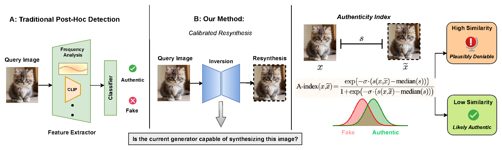
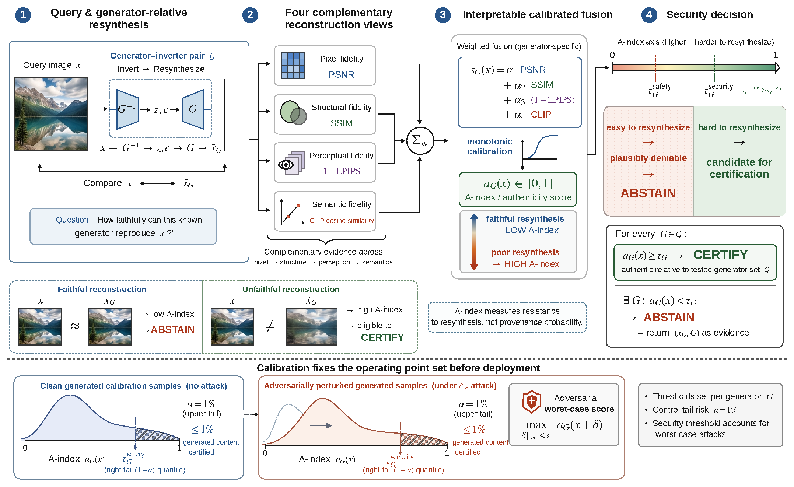
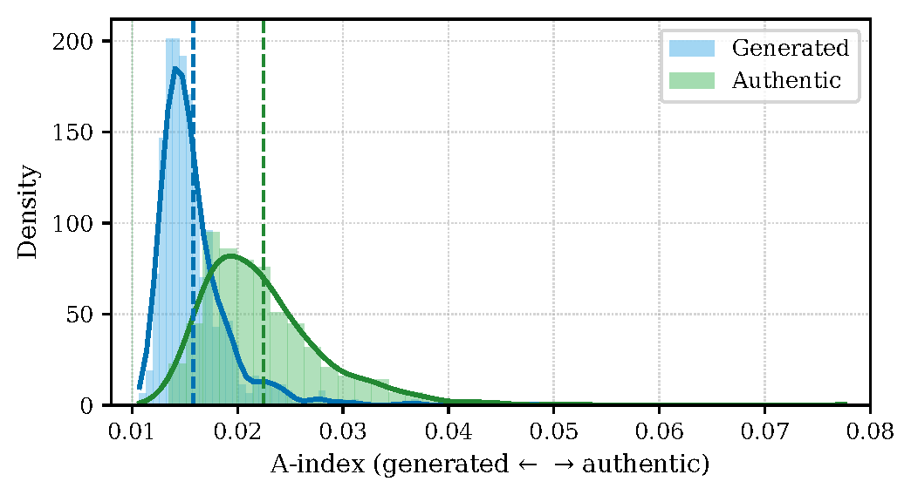
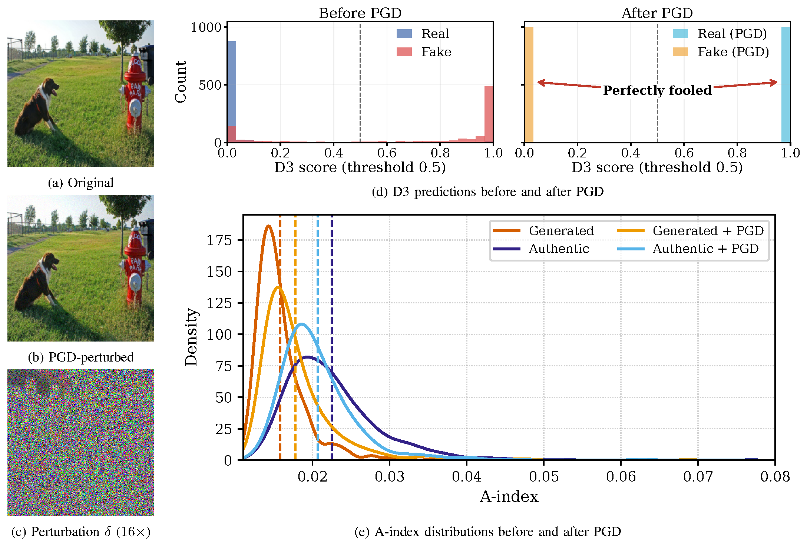
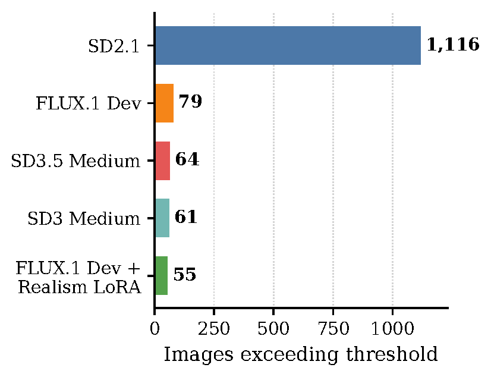

# Certification of Real Images through Calibrated Content Authentication

**Sarim Hashmi, Abdelrahman Elsayed, Mohammed Talha Alam, Samuele Poppi, Nils Lukas**  
*Mohamed bin Zayed University of Artificial Intelligence (MBZUAI)*

[Paper](https://arxiv.org/abs/2610.05870) · [PDF](https://arxiv.org/pdf/2610.05870) · [Installation](#installation) · [Reproduction](#reproducing-the-benchmark) · [Citation](#references-and-citation)

Code, benchmarks, and analysis for **calibrated content authentication**: a method that certifies an image as authentic relative to a tested set of generators, with a calibrated false-certification rate, and abstains when a generator can faithfully reconstruct it.

The repository includes an evaluation of **20 deepfake detectors against 10 generators** released between December 2022 and May 2026, white-box adversarial attacks, and the inversion-based certification pipeline.


## Overview

A generator can reproduce authentic content, including through memorization. When authentic and generated images can be identical, image content alone cannot uniquely establish provenance.

Our method asks a narrower question: **can a known generator faithfully reconstruct the query image?**

- If any tested generator can, synthetic provenance is plausible. The method abstains and returns the reconstruction as evidence.
- If none can, the method certifies the image as authentic relative to the tested generators and calibrated thresholds.

Calibration controls how often generated images are incorrectly certified as authentic. Attack-aware calibration uses a stricter threshold for the evaluated bounded-perturbation setting.

> Certification is relative to the tested generators and calibration setting. Abstention does not mean an image is fake, and certification is not an unconditional proof of provenance.



## Key findings

- **Generalization declines over time.** Across ten generators, the best accuracy among twenty detectors falls from **99.5% to 76%**. The leading detector changes from PROBE to SICA to D3.
- **Bounded attacks defeat the evaluated binary detectors.** Under an ℓ∞ attack with ε = 8/255, all twenty detectors fall below **2% accuracy**; D3 retains the highest accuracy at **1.75%**.
- **Calibration enables selective certification.** At a target false-certification rate of **1%**, our method still certifies authentic content. Most baselines have near-zero authentic-image recall at this operating point, including the baseline with roughly 93% classification accuracy.
- **Attack-aware calibration supports the evaluated security setting.** For SD3 Medium, the threshold increases from **0.0365 to 0.038**. A best-of-100 attacker with PGD raises its best candidate's A-index only from **0.0148 to 0.0154**. Separately, **23 of 24** semantic transformations remain below the safety threshold.
- **Fewer social-media images exceed newer thresholds.** Of 3,000 unverified Reddit images, **1,116** exceed the SD2.1 threshold, compared with **55–79** for the four newer configurations when applied to the same SD3 inversion scores.

## Method

### 1. Reconstruct the query image

For each generator $G$ in the tested set, use RF-Inversion to reconstruct the query image $x$, producing $\tilde{x}_G$.

### 2. Compute the Authenticity Index

Compare the image and its reconstruction using pixel fidelity (PSNR), structural similarity (SSIM), perceptual similarity ($1 - \mathrm{LPIPS}$), and semantic similarity (CLIP). Combine these measurements into the **Authenticity Index (A-index)**:

$$
s(x, \tilde{x}_G) = \alpha_1\,\mathrm{PSNR} + \alpha_2\,\mathrm{SSIM} + \alpha_3\,(1 - \mathrm{LPIPS}) + \alpha_4\,\mathrm{CLIP}
$$

$$
A(x, \tilde{x}_G) = \frac{\exp(-\sigma s)}{1 + \exp(-\sigma s)}
$$

The fitted weights are $\alpha_1 = -0.0181$, $\alpha_2 = 1.380$, $\alpha_3 = -4.058$, and $\alpha_4 = 8.066$, with $\sigma = 0.9$. The metric is implemented in [`inversion/metric.py`](inversion/metric.py).

The A-index lies in $[0, 1]$. Faithful reconstructions receive low scores, making authenticity plausibly deniable.



### 3. Calibrate and certify

For each generator, set the **safety threshold** to the $(1 - \alpha)$-quantile of A-index scores on held-out generated samples, with a target false-certification rate of $\alpha = 0.01$. The **security threshold** uses the same quantile after attacking the calibration samples with ℓ∞-bounded PGD.

Certify a query only when its A-index meets or exceeds the corresponding threshold for **every** tested generator. Otherwise, abstain and return the reconstruction as evidence.

| Generator configuration | Safety threshold |
| --- | ---: |
| SD2.1 | 0.015 |
| SD3 Medium | 0.0365 |
| SD3.5 Medium | 0.0365 |
| FLUX.1 Dev | 0.035 |
| FLUX.1 Dev + Realism LoRA | 0.038 |

Certification takes **11.67 seconds per image per generator** on one NVIDIA RTX 5000 Ada.

For SD3 Medium, reconstruction fidelity separates authentic and generated images:



## Results


### Adversarial robustness

 PGD with ε = 8/255 on 2,000 images (1,000 fake, 1,000 real,
512×512). Only samples classified correctly before the attack are perturbed. † marks
threshold-degenerate detectors; "–" means no sample of that class was correct before the attack.

| Model | Correct fake (before) | Correct real (before) | Acc. before (%) | Correct fake (after) | Correct real (after) | Acc. after (%) | Attack success on fake (%) | Attack success on real (%) |
|---|---|---|---|---|---|---|---|---|
| UFD | 1 | 974 | 48.75 | 0 | 0 | 0.00 | 100.0 | 100.0 |
| FreqNet | 53 | 995 | 52.40 | 0 | 0 | 0.00 | 100.0 | 100.0 |
| NPR | 86 | 653 | 36.95 | 0 | 0 | 0.00 | 100.0 | 100.0 |
| FatFormer | 1 | 987 | 49.40 | 0 | 0 | 0.00 | 100.0 | 100.0 |
| AEROBLADE† | 778 | 778 | 77.80 | 0 | 30 | 1.50 | 100.0 | 96.1 |
| C2PClip | 51 | 949 | 50.00 | 0 | 2 | 0.10 | 100.0 | 99.8 |
| D3 | 736 | 942 | 83.90 | 24 | 11 | **1.75** | 96.7 | 98.8 |
| FIRE† | 998 | 0 | 49.90 | 1 | 0 | 0.05 | 99.9 | – |
| DDA | 576 | 975 | 77.55 | 0 | 4 | 0.20 | 100.0 | 99.6 |
| FerretNet | 40 | 962 | 50.10 | 0 | 0 | 0.00 | 100.0 | 100.0 |
| WaRPAD† | 689 | 689 | 68.90 | 15 | 0 | 0.75 | 97.8 | 100.0 |
| APM | 34 | 987 | 51.05 | 0 | 0 | 0.00 | 100.0 | 100.0 |
| OmniAID | 917 | 948 | **93.25** | 0 | 0 | 0.00 | 100.0 | 100.0 |
| PGC | 304 | 951 | 62.75 | 0 | 0 | 0.00 | 100.0 | 100.0 |
| PROBE | 539 | 990 | 76.45 | 0 | 1 | 0.05 | 100.0 | 99.9 |
| DEAR | 417 | 993 | 70.50 | 0 | 0 | 0.00 | 100.0 | 100.0 |
| DGS-Net | 10 | 847 | 42.85 | 0 | 0 | 0.00 | 100.0 | 100.0 |
| SICA | 716 | 924 | 82.00 | 0 | 0 | 0.00 | 100.0 | 100.0 |
| IAPL | 14 | 980 | 49.70 | 0 | 0 | 0.00 | 100.0 | 100.0 |
| ForensicCpt | 55 | 982 | 51.85 | 0 | 2 | 0.10 | 100.0 | 99.8 |

In the evaluated setting, PGD reduces binary-detector accuracy to below 2%, while the A-index distributions remain separated:



### Social-media study

 We apply five generator-specific thresholds to the same SD3 inversion
scores of 3,000 unverified Reddit images: 1,116 images exceed the SD2.1 threshold, against 55 to
79 for the four newer configurations. These images are unverified; threshold exceedance does not establish their true provenance.

<p align="center"></p>

### Preliminary video evaluation

 On 100 videos from Deepfake-Eval-2024 (50 authentic, 50 generated),
video detectors transfer poorly, while frame-aggregated A-index scores preserve the image-level
ordering.

| Model | AUC | Prec. | Rec. | F1 |
|---|---|---|---|---|
| GenConViT | 0.615 | 0.59 | 0.49 | 0.53 |
| FTCN | 0.483 | 0.50 | 0.64 | 0.40 |
| StyleFlow | 0.509 | 0.53 | 0.42 | 0.47 |

## Repository structure

| Path | Purpose |
| --- | --- |
| [`benchmark/`](benchmark/) | Detector benchmarking, normalization, analysis, and attack aggregation |
| [`benchmark/adapters/`](benchmark/adapters/) | Detector wrappers with a common inference interface |
| [`benchmark/attacks/`](benchmark/attacks/) | Per-detector white-box PGD harnesses and shared attack engine |
| [`benchmark/docs/`](benchmark/docs/) | Adapter and PGD attack contracts |
| [`benchmark/plots/`](benchmark/plots/) | Benchmark figures |
| [`inversion/`](inversion/) | Conditioned and unconditioned RF-Inversion through SD2, SD3, and SD3.5 |
| [`inversion/metric.py`](inversion/metric.py) | Reconstruction metrics and A-index computation |
| [`assets/`](assets/) | Figures from the paper |

## Installation

A GPU is required for detector inference, inversion, and PGD attacks. Run the following commands from the repository root:

```bash
python -m venv venv
source venv/bin/activate
pip install -r requirements.txt
```

Detector checkpoints and generator weights are **not included** because they are large or access-gated. Obtain the required weights before running the experiments. Detector adapters load checkpoints from the local detector zoo:

```text
detectors/<year>/<Name>/weights/
```

See the [adapter contract](benchmark/docs/ADAPTER_CONTRACT.md) for the expected checkpoint layout and inference interface.

## Reproducing the benchmark

### Prepare the evaluation manifest

The file `benchmark/manifest.csv` contains one image per row with these columns:

```text
generator,gen_year,label,path
```

### Normalize, evaluate, and analyze

Run from the repository root:

```bash
# Normalize images to 512 × 512 to remove the real/fake resolution confound.
# Output: benchmark/manifest_normalized.csv
python benchmark/normalize_images.py

# Evaluate all detectors on the normalized manifest.
# Output: benchmark/scores/<Detector>.csv
python benchmark/run_all.py \
    --device cuda \
    --manifest benchmark/manifest_normalized.csv \
    --scores-dir benchmark/scores

# Generate accuracy and AUROC tables and figures.
# Outputs: benchmark/results.csv and benchmark/plots/
python benchmark/analyze.py
```

### Evaluate adversarial robustness

The reported white-box PGD evaluation uses **ε = 8/255** and **10 steps**. Replace `<Detector>` with the name used by the corresponding attack script and `<manifest.csv>` with your manifest path, resolved from `benchmark/`.

```bash
cd benchmark

# Run the per-detector attack harness.
python attacks/attack_<Detector>.py \
    --manifest <manifest.csv> \
    --out attacks_out/<Detector>.csv \
    --device cuda

# Aggregate the per-detector attack results.
# Outputs: results_attack.json and results_attack.md
python aggregate_attacks.py
```

Each detector adapter accepts `--manifest`, `--out`, `--device`, and optional `--limit` arguments. Its output contains:

```text
generator,gen_year,label,path,score
```

Higher detector scores indicate a greater likelihood of generated content. See the [adapter contract](benchmark/docs/ADAPTER_CONTRACT.md) and [PGD attack contract](benchmark/docs/PGD_ATTACK_CONTRACT.md) for details.

## Reproducing the certification method

Run from the repository root. Replace the placeholders with your image and reconstruction directories.

```bash
# Reconstruct query images with a known generator (SD3.5 example).
python inversion/sd3.5_all_in.py \
    --input_dir <query_images> \
    --output_dir <reconstructions>

# Compute PSNR, SSIM, LPIPS, CLIP similarity, and the A-index.
python inversion/metric.py \
    --source_dir <query_images> \
    --recon_dir <reconstructions> \
    --out metrics.jsonl
```

Use the per-image scores in `metrics.jsonl` to calibrate generator-specific thresholds on generated calibration samples. Evaluate certification on separate held-out content. For the security setting, calibrate on attacked generated samples under the intended perturbation budget.

Repeat the reconstruction and scoring procedure for each generator in the certification set. A query is certified only if it meets every generator-specific threshold.

## Evaluated models

### Detectors

UFD, FreqNet, NPR, FatFormer, AEROBLADE, C2P-CLIP, D3, FIRE, DDA, FerretNet, WaRPAD, AllPatchesMatter, OmniAID, PGC, PROBE, DEAR, DGS-Net, SICA, IAPL, and ForensicConcept.

Each detector has an [inference adapter](benchmark/adapters/) and a [PGD attack harness](benchmark/attacks/). In the results table, AllPatchesMatter is abbreviated as **APM**, ForensicConcept as **ForensicCpt**, and C2P-CLIP as **C2PClip**.

### Generators

The benchmark covers ten generator configurations spanning December 2022 to May 2026, including SD2.1, SD3, SD3.5, FLUX.1 with LoRA and Boreal adapters, FLUX.2, GPT Image-2, and HiDream-O1.

Certification is calibrated for five configurations: **SD2.1, SD3 Medium, SD3.5 Medium, FLUX.1 Dev, and FLUX.1 Dev with Realism LoRA**.

## Scope and interpretation

- The false-certification rate concerns generated content incorrectly certified as authentic. It is distinct from overall classification accuracy and the fraction of authentic images certified.
- Certification depends on the tested generators, inversion procedure, and calibration setting. It does not establish provenance against every possible generator.
- The security evaluation concerns bounded perturbations under the evaluated attack setting. It does not cover arbitrary adversarial transformations.
- The Reddit images are unverified, and the study applies different thresholds to the same SD3 inversion scores. Its counts should not be interpreted as ground-truth authenticity labels or separate inversions through every generator.
- The video experiment is preliminary and uses 100 videos. The table reports video-detector baselines; the frame-aggregated A-index observation is qualitative here.

## Contact

For questions, implementation issues, or reproducibility discussions, please open an issue in this repository or contact the authors at MBZUAI.

## References and citation

If you use this code, benchmark, or method in your research, please cite:

Sarim Hashmi, Abdelrahman Elsayed, Mohammed Talha Alam, Samuele Poppi, and Nils Lukas. **Certification of Real Images through Calibrated Content Authentication.** arXiv:2610.05870, 2026. [Paper](https://arxiv.org/abs/2610.05870) · [PDF](https://arxiv.org/pdf/2610.05870).

```bibtex
@article{hashmi2026certification,
  title         = {Certification of Real Images through Calibrated Content Authentication},
  author        = {Hashmi, Sarim and Elsayed, Abdelrahman and Alam, Mohammed Talha and Poppi, Samuele and Lukas, Nils},
  journal       = {arXiv preprint arXiv:2610.05870},
  year          = {2026},
  eprint        = {2610.05870},
  archivePrefix = {arXiv},
  url           = {https://arxiv.org/abs/2610.05870}
}
```
