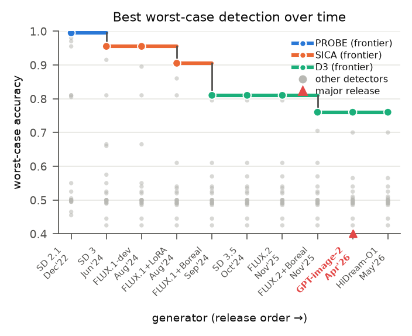

# Certification of Real Images through Calibrated Content Authentication

Sarim Hashmi, Abdelrahman Elsayed, Mohammed Talha Alam, Samuele Poppi, Nils Lukas
*Mohamed bin Zayed University of Artificial Intelligence (MBZUAI)*

This repository contains the code, evaluation benchmark, and analysis for the paper. It
covers (i) a benchmark of twenty deepfake detectors against ten generators released between
2022 and 2026, (ii) their robustness under bounded adversarial perturbations, and (iii) our
calibrated content-authentication method that *certifies* an image as real with a bounded
error rate instead of classifying every input.



## Summary

Post-hoc deepfake detection is unreliable in the long run: a capable generator can reproduce
authentic content exactly (for example through memorization), so content alone does not
determine its provenance and any detector that labels every input makes errors at a rate it
cannot control. We instead ask a measurable question. Given a suspect image, can a known
generator reconstruct it faithfully under inversion? If it can, the image is plausibly
deniable and we abstain. If no known generator can, we certify the image as authentic
relative to the tested generators. The decision threshold is calibrated so that at most a
chosen fraction of generated content is wrongly certified, and a stricter threshold preserves
the bound against an adaptive adversary.

## Key findings

- Across ten generators from 2022 to 2026, the best of twenty detectors drops from 99.5% to
  76% accuracy, and the best detector changes twice (PROBE, then SICA, then D3).
- Under an l-infinity attack with epsilon = 8/255, all twenty detectors fall below 2% accuracy;
  the strongest, D3, retains 1.75%.
- Calibrated at a 1% wrong-certification rate, our method still certifies authentic content at
  an operating point where most detectors reach near-zero recall.
- Post-hoc verifiability is eroding: of 3,000 Reddit images, 1,116 resist reproduction by a
  2022 generator but only 55 to 79 resist 2024 generators.

## Repository structure

```
benchmark/     Detector benchmark and adversarial evaluation
  adapters/    One wrapper per detector (uniform inference interface)
  attacks/     White-box PGD harnesses (one per detector) + shared engine
  manifests/   Image lists for each evaluation set
  results/     Per detector-by-generator accuracy/AUROC, attack results
  tables/      Paper tables (LaTeX) and references.bib
  plots/       Paper figures (frontier curves, per-detector distributions)
  *.py         run_all.py, analyze.py, aggregate_attacks.py, make_frontier.py, ...

generation/    Building the generator set (images from the ten generators)
inversion/     Calibrated resynthesis: inversion, similarity, and A-index metrics
rf-inversion/  RF-Inversion pipeline used to resynthesize a query image
scripts/       Helpers for fetching detector/model weights
```

The detector checkpoints and generator weights are large or gated and are **not** stored in
this repository; adapters load them from a local detector zoo (see `benchmark/README.md`).

## Installation

```bash
python -m venv venv && source venv/bin/activate
pip install -r requirements.txt
```

GPU is required for detector inference, generation, inversion, and the PGD attacks. On a
SLURM cluster, launch GPU jobs with the provided `*.sbatch` scripts rather than on the login node.

## Reproducing the benchmark

```bash
cd benchmark
# 1. normalize images to 512x512 to remove the real/fake resolution confound
python normalize_images.py
# 2. run every detector over the evaluation manifest
python run_all.py --device cuda --manifest manifests/manifest_normalized.csv --scores-dir scores
# 3. build the accuracy / AUROC tables and the frontier figures
python analyze.py
python make_frontier.py
```

Adversarial robustness (white-box PGD, epsilon = 8/255, 10 steps):

```bash
# per-detector harness -> attacks_out/<Detector>.csv
python attacks/attack_<Detector>.py --manifest manifests/manifest_newbench.csv \
    --out attacks_out/<Detector>.csv --device cuda
# aggregate into the before/after table
python aggregate_attacks.py
```

Each detector adapter follows a fixed interface (`--manifest --out --device [--limit]`) and
writes `generator,gen_year,label,path,score` with higher scores meaning more likely fake; see
`benchmark/ADAPTER_CONTRACT.md` and `benchmark/PGD_ATTACK_CONTRACT.md`.

## Reproducing the certification method

The method resynthesizes a query image through a known generator with RF-Inversion and scores
the similarity between the image and its reconstruction into an Authenticity Index (A-index).

```bash
# resynthesize query images through a generator (example: SD3.5)
python inversion/sd3.5_all_in.py
# compute similarity metrics between images and their reconstructions
python inversion/finally_metric/metric1.py    # (see the metric scripts in that folder)
```

Calibrate the decision threshold on generated samples so that at most a chosen fraction are
certified, then evaluate certification on held-out content. The `inversion/` outputs
(`*_metrics.jsonl`) hold the per-image similarity scores used for calibration.

## Detectors evaluated

UFD, FreqNet, NPR, FatFormer, AEROBLADE, C2P-CLIP, D3, FIRE, DDA, FerretNet, WaRPAD,
AllPatchesMatter, OmniAID, PGC, PROBE, DEAR, DGS-Net, SICA, IAPL, ForensicConcept. Backbones,
detection cues, and citations are listed in `benchmark/tables/references.bib`.

## Generators evaluated

SD 2.1, SD 3, SD 3.5, FLUX.1 (with LoRA and Boreal adapters), FLUX.2, GPT Image-2, and
HiDream-O1, spanning December 2022 to 2026.

## Citation

```bibtex
@article{hashmi2026certification,
  title   = {Certification of Real Images through Calibrated Content Authentication},
  author  = {Hashmi, Sarim and Elsayed, Abdelrahman and Alam, Mohammed Talha and Poppi, Samuele and Lukas, Nils},
  year    = {2026}
}
```

## Contact

Questions and issues are welcome via the repository issue tracker or by email to the authors
at MBZUAI.
